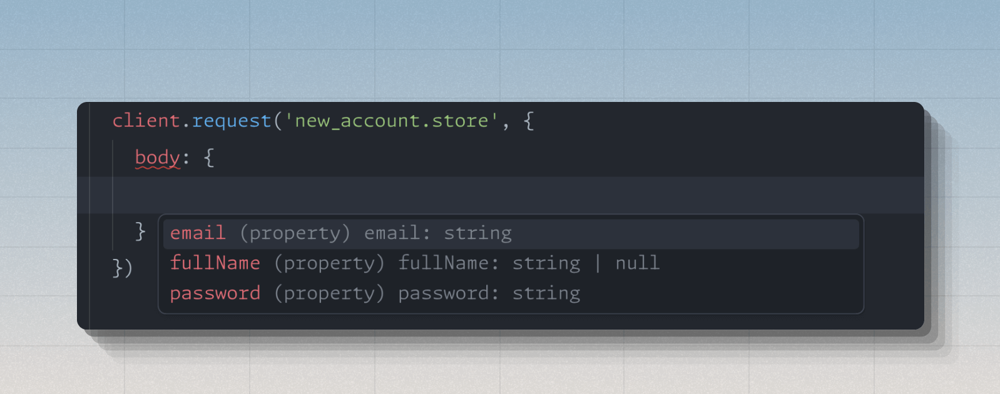

We have made over 20 releases targeting AdonisJS v7 since last month. Many of these are bug fixes, [small improvements](https://github.com/adonisjs/http-server/releases/tag/v8.0.0-next.11), and [internal APIs](https://github.com/adonisjs/http-server/releases/tag/v8.0.0-next.9) needed by the framework core and official packages. Some of them are bigger user-land improvements you can experience today with v7 applications.

:::note
Before diving into the details, I want to re-iterate that the surface area of breaking changes with v7 is tiny. We expect everyone to upgrade their apps within a few minutes to v7 when it becomes publicly available.
:::

## Starter kits now include login and signup flows

All starter kits — React and Hypermedia — now include simple login and signup flows. These flows handle basic email and password authentication to help you get started quickly without having to build these pages from scratch.

The approach is intentionally minimal. You get the essentials needed to authenticate users so you can focus on building the core features of your application. Security improvements and edge cases can be refined later without blocking progress.

::video{src="https://res.cloudinary.com/adonis-js/video/upload/v1761292002/auth-flows-hypermedia_noglrm.mp4" controls="true"}

<br>

You can read more about the philosophy behind our starter kits in the [Rethinking Starter Kits](https://adonisjs.com/blog/rethinking-starter-kits) article.

## Revamped Inertia package

The Inertia package has been updated with two significant improvements: support for transformers and a better approach to shared data.

### Transformers

Transformers allow you to serialize data returned by controllers before sending it to the frontend. This gives you fine-grained control over what gets sent to the client and how it is structured. **The inertia package integrates natively with transformers and all Inertia props can be transformer items or collections.**

You can learn more about transformers in the [Insiders documentation](https://insiders.adonisjs.com/docs/v7-alpha/transformers).

### Shared data moved to middleware

Previously, shared data was defined in the Inertia config file. This approach had limitations since config files are imported during the framework boot cycle, making it awkward to import models or transformers.

We have moved shared data to a middleware, which is a better fit for this use case. Here is what the change looks like.


#### Before (using config file)

```ts
import { defineConfig } from '@adonisjs/inertia'

export default defineConfig({
  sharedData: {
    appName: 'My App',
    user: (ctx) => ctx.auth?.user,
    flash: (ctx) => {
      return {
        error: ctx.session.flashMessages.get('error'),
        success: ctx.session.flashMessages.get('success')
      }
    }
  },
})
```

#### After (using middleware)
```ts
import UserTransformer from '#transformers/user_transformer'
import BaseInertiaMiddleware from '@adonisjs/inertia/inertia_middleware'

export default class InertiaMiddleware extends BaseInertiaMiddleware {
  share(ctx: HttpContext) {
    const { session, auth } = ctx

    return {
      errors: this.getValidationErrors(ctx),
      flash: {
        error: session.flashMessages.get('error'),
        success: session.flashMessages.get('success'),
      },
      user: UserTransformer.transform(auth.user),
    }
  }
}
```

The middleware approach makes it easier to import and use models, transformers, or any other modules you need to compute shared data.

### Type-safe Inertia.render method

The `Inertia.render` method is now fully type-safe. This required building a scanner that walks through the frontend codebase and generates TypeScript types for all your pages.

The generated types are stored in `.adonisjs/server/pages.d.ts` and look like this:

```ts
import '@adonisjs/inertia/types'
import type React from 'react'
import type { Prettify } from '@adonisjs/core/types/common'

type ExtractProps<T> =
  T extends React.FC<infer Props>
    ? Prettify<Omit<Props, 'children'>>
    : T extends React.Component<infer Props>
      ? Prettify<Omit<Props, 'children'>>
      : never

declare module '@adonisjs/inertia/types' {
  export interface InertiaPages {
    'auth/login': ExtractProps<(typeof import('../../inertia/pages/auth/login.tsx'))['default']>
    'auth/signup': ExtractProps<(typeof import('../../inertia/pages/auth/signup.tsx'))['default']>
    'errors/not_found': ExtractProps<(typeof import('../../inertia/pages/errors/not_found.tsx'))['default']>
    'errors/server_error': ExtractProps<(typeof import('../../inertia/pages/errors/server_error.tsx'))['default']>
    'home': ExtractProps<(typeof import('../../inertia/pages/home.tsx'))['default']>
  }
}
```

These types enable autocomplete and type checking when rendering Inertia pages from your controllers.


## Multi-limiter

The rate limiter package now supports consuming points from multiple limiter instances in one go using the `limiter.multi` method. This is particularly useful when implementing dual rate-limiting strategies, such as during login flows.

Previously, implementing dual rate-limiting required manually managing multiple limiters and handling their state separately. Here is what it looked like:

```ts
const ipKey = `login_${request.ip()}`
const emailKey = `login_${request.ip()}_${payload.email}`

const ipLimiter = limiter.use({ duration: '1 min', requests: 10 })
const emailLimiter = limiter.use({ duration: '1 min', requests: 5, blockDuration: '20 mins' })

try {
  await User.verifyCredentials(payload.email, payload.password)
  await ipLimiter.delete(ipKey)
  await ipLimiter.delete(emailKey)
} catch (error) {
  await ipLimiter.consume(ipKey)
  await emailLimiter.consume(emailKey)
}
```

With multi-limiter, the code becomes much cleaner:

```ts
const ipKey = `login_${request.ip()}`
const emailKey = `login_${request.ip()}_${payload.email}`

const loginLimiter = limiter.multi([
  { duration: '1 min', requests: 10, key: ipKey },
  { duration: '1 min', requests: 5, blockDuration: '20 mins', key: emailKey }
])

/**
 * The penalize method will consume one point if the provided callback
 * throws an exception. Otherwise, it will reset the points
 */
await loginLimiter.penalize(() => {
  return User.verifyCredentials(payload.email, payload.password)
})
```

The `penalize` method handles the logic of consuming or resetting points based on whether the callback succeeds or fails, making dual rate-limiting straightforward to implement.

## VineJS v4

VineJS has been updated to v4 with several notable improvements:

- Support for the [Standard Schema](https://standardschema.dev/) specification
- Ability to pick and omit properties during schema re-use
- Ability to mark union types as nullable and optional

You can check out the complete list of changes in the [VineJS v4 release notes](https://github.com/vinejs/vine/releases/tag/v4.0.0).

## Next in the pipeline

### RPC client and type-safe URL builder

We are working on an RPC client and type-safe URL builder for Inertia applications. The RPC client provides a type-safe fetch API for client applications, while the URL builder allows you to create URLs using route names instead of hardcoding them.

This way, changing a route definition later will not break anything in your codebase. The URLs are generated dynamically based on the route name.

Building these features required writing a routes scanner that walks through controllers and validators to generate a map of routes along with their expected inputs and outputs. You can check out the [implementation on GitHub](https://github.com/adonisjs/assembler/blob/8.x/src/code_scanners/routes_scanner/main.ts) if you are curious about the low-level details.



### Encryption module

We are adding support for key rotation and multiple encryption algorithms to the encryption module. Key rotation will allow you to frequently recycle encryption keys without loosing data that was previously encrypted with an old key.

### Session collection

The [session collection](https://github.com/orgs/adonisjs/projects/8/views/1?pane=issue&itemId=138502741&issue=adonisjs%7Csession%7C92) feature will provide low-level APIs needed to build features like "logout from all devices" within AdonisJS applications. This gives you more control over how sessions are managed across multiple devices or browsers.

### Full roadmap

You can check out the complete development roadmap on [GitHub](https://github.com/orgs/adonisjs/projects/8/views/1) to see what else we are working on.

## Conclusion

AdonisJS v7 is currently in closed preview and available to [Insiders](https://github.com/sponsors/thetutlage). If you are an Insider, you can start using all these improvements and changes today. Your feedback will help shape the final version of v7 before the public release.

We expect the upgrade path to be smooth since the breaking changes are minimal. The goal is to deliver meaningful improvements without disrupting existing applications.
