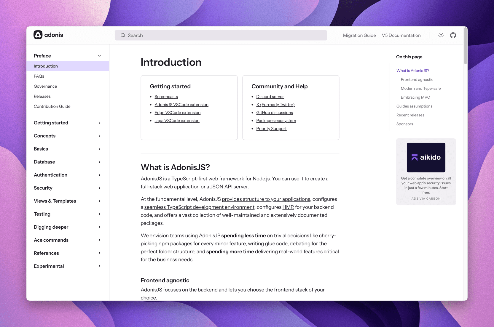

As we enter May, it's a great opportunity to reflect on the recent enhancements and updates made to AdonisJS last month.

## Hot Module Replacement (HMR)

In April, we successfully implemented Hot Module Replacement (HMR) in AdonisJS with [Hot Hook](https://github.com/Julien-R44/hot-hook). HMR allows you to modify the code of your controllers, middleware, or services without needing to restart the entire server, significantly enhancing the developer experience (DX). 

You can find more details on this [in the article](https://docs.adonisjs.com/guides/hmr) we recently published, which delves deeper into the specifics of this feature. Starter-kits now also include HMR by default. If you are working on an ongoing AdonisJS 6 project, be sure to check out the [documentation](https://docs.adonisjs.com/guides/hmr) to learn how to enable it!

- Documentation: https://adonisjs.com/blog/hmr-in-adonisjs

- Article: https://docs.adonisjs.com/guides/hmr

## Transmit

We finally released the first 1.0.0 version of [Transmit](https://github.com/adonisjs/transmit), our opinionated [Server-Sent-Events](https://developer.mozilla.org/en-US/docs/Web/API/Server-sent_events) library, designed to make it easy to send real-time updates to your front-end applications. 

The documentation [is now available](https://docs.adonisjs.com/guides/digging-deeper/transmit) and we plan to write an article about it in the coming weeks.

- Documentation: https://docs.adonisjs.com/guides/digging-deeper/transmit

## Documentation improvements

Some weeks ago, we opened [an issue](https://github.com/adonisjs/v6-docs/issues/80) on the documentation repo to discuss restructuring the docs. Many of you read and shared your ideas. We've incorporated your feedback and have started working on a new structure, that is now [available and published](https://docs.adonisjs.com/). 



This revamped structure is more organized and easier to follow, and we've also added some new sections. We also have added pretty OG images for each page :


Let us know what you think about the new structure and if you have any suggestions for further improvements.

- New Documentation: https://docs.adonisjs.com/

## env\:add command

We've introduced a new command in AdonisJS to help you add environment variables to your `.env`, `.env.example`, and `start/env.ts` files directly from the command line. This saves time from having to open three different files during development whenever you realize a new environment variable is needed.

You can now use the command with the following syntax:

```sh
node ace env:add MY_VARIABLE value --type=string
```

Or just run the command without any arguments to get prompted for the variable name, value, and type.

- Documentation: https://docs.adonisjs.com/guides/references/commands#envadd

## InferPageProps in Inertia

We've shipped an utility type in `@adonisjs/inertia` that makes it easier to share types between your front-end and back-end. 

```ts
export default class UsersController {
  async index({ inertia }: HttpContext) {
    const users = [
      { id: 1, name: 'John Doe', createdAt: new Date() }
    ]

    return inertia.render('users/index', { users })
  }
}
```

```ts
import type { InferPageProps } from '@adonisjs/inertia'
import type UsersController from '#controllers/users_controller'

function UsersList(
  props: InferPageProps<UsersController, 'index'>
) {
  props.users
  //      ^? { id: number, name: string, createdAt: string }[]
}
```

This feature should help save time and reduce typing errors in your Inertia applications. Note that the `createdAt` field is automatically converted to a string in your front-end component type, as Dates are serialized into strings when passed over the wire in JSON. This `InferPageProps` type performs this serialization at the type level automatically for you.

- Documentation: https://docs.adonisjs.com/guides/inertia#share-types

## Published articles

- **HMR in AdonisJS**\
  https://adonisjs.com/blog/hmr-in-adonisjs

## In case you missed it

- **A new package to manage permissions with ACLs in AdonisJS**\
  https://github.com/holoyan/adonisjs-permissions

- **Meta-framework for building fullstack apps with AdonisJS and Remix.**\
  https://github.com/jarle/remix-adonisjs

- **Package for background jobs based on `node-resque`**\
  https://github.com/shiny/adonis-resque

- **Edge-Components (UI Kit based on DaisyUI and Alpine.js) updated for AdonisJS 6**\
  https://github.com/batosai/edge-components?tab=readme-ov-file

## Notable Releases

<div class="links_list">

- **Add `env:add` command to define environment variable and its validation rules.**\
  https://github.com/adonisjs/core/releases/tag/v6.9.0

- **Moving HMR out of experimental phase.**\
  https://github.com/adonisjs/core/releases/tag/v6.8.0

- **Experimental support for HMR.**\
  https://github.com/adonisjs/core/releases/tag/v6.7.0

- **Upgrade to VineJS 2.0.**\
  https://github.com/adonisjs/core/releases/tag/v6.6.0

- **Configure basic auth guard and export authFinder mixin from its own subpath.**\
  https://github.com/adonisjs/auth/releases/tag/v9.2.0

</div>
