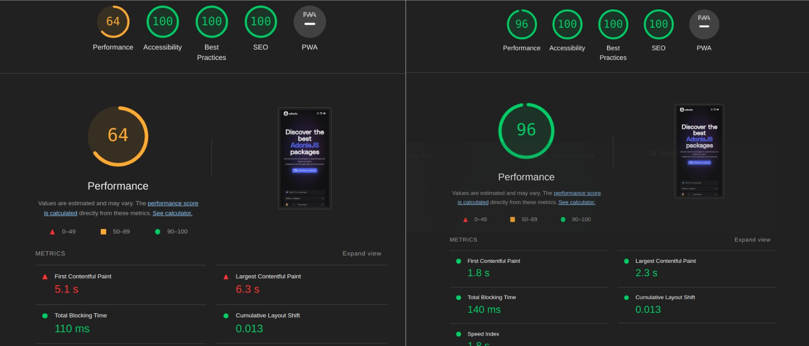

We are pleased to announce that the Inertia adapter for AdonisJS is now available as an experimental version with **full support for SSR**.

By experimental version, we mean that the adapter is ready to be used and functional, but we're waiting for more feedback to stabilize all APIs and fix uncaught bugs. We may push breaking changes during the experimental version without bumping the semver major number.

Alongside Interia, we released an experimental version of our [Vite integration](#major-vite-release-experimental) and [introduced assembler hooks](#expiremental-assembler-hooks). We will cover these changes in this article, but let's start with Inertia first.

## Creating a project using the Inertia starter kit

To help you get started quickly with Inertia, we've created an official [starter kit](https://github.com/adonisjs/inertia-starter-kit) for Inertia. This starter kit is based on the `web-starter-kit`, which comes with the Auth layer, Lucid, and our Inertia adapter. 

During the installation process, you can choose the frontend framework of choice (Vue, React, Svelte, Solid) and configure support for SSR.

```sh
# Run the following command and select the inertia starter kit
npm init adonisjs

# or use arguments to skip the prompts
npm init adonisjs my-app --kit=inertia --framework=solid --ssr
```

You'll have a ready-to-use application with Inertia, with or without SSR, your favorite frontend framework, and all the rest.

We also added a route with an associated example component to show you how to use Inertia. So, you can launch your application, visit `localhost:3333/inertia`, and see Inertia in action.

## Integrating Inertia inside an existing project

If you don't want to use the starter kit, you can incrementally integrate Interia inside an existing AdonisJS application. For that, you will have to first update the following packages.

- `@adonisjs/assembler` >= 7.2.3
- `@adonisjs/core` >= 6.3.1
- `@adonisjs/vite` >= 3.0.0-6
- `vite` >= 5.1.4

```sh
npm i @adonisjs/core@latest @adonisjs/vite@next
npm i -D vite@latest @adonisjs/assembler@latest
```

Once these versions are installed, you'll need to update your `adonisrc.ts` file to disable asset bundling management by the Assembler and enable experimental hooks.

As you can see, the config block is prefixed with the `unstable_` keyword to enable experimental hooks. This API is open to change in the future without any major release. We are waiting for your feedback to stabilize it. Learn more about [Assembler hooks](#assembler-hooks).

```ts
export default defineConfig({
  // ...

  // insert-start
  assetsBundler: false,
  unstable_assembler: {
    onBuildStarting: [() => import('@adonisjs/vite/build_hook')],
  },
  // insert-end

  // ...
})
```

Finally, you can install and configure the `@adonisjs/inertia` package and start using it. Also, consult the [Interia adapter documentation](https://docs.adonisjs.com/guides/inertia).

```sh
node ace add @adonisjs/inertia
```

## Major Vite release (experimental)

We have shipped a new version of the `@adonisjs/vite` package that warrants a major release. The motivation behind the change is explained [in this article](https://adonisjs.com/blog/future-plans-for-adonisjs-6#adonisjsvite).

However, here's a quick TLDR:

Before, Vite was launched as a child process by AdonisJS assembler. Now, Vite is launched within the same process as AdonisJS. By having AdonisJS and Vite inside the same process, we can use Vite's JavaScript APIs needed to bring in SSR support for Inertia-based applications.

We expect this new version of `@adonisjs/vite` to behave like the current stable version. However, because of the architectural changes, we want to keep this change under the experimental flag and get aware of all the surprises before asking everyone to upgrade.

Alongside, the following are some highlights from the new major version of our Vite integration.

### Middleware mode

The new version relies on the Vite's [middleware mode](https://vitejs.dev/guide/ssr.html#setting-up-the-dev-server), in which we register a middleware with the AdonisJS HTTP server and forward requests for the frontend assets to Vite.

The middleware is registered only during the development since, in production, we serve pre-compiled frontend assets using the static file server of AdonisJS.

### Preloading assets

The new Vite version introduces built-in support for asset preloading.

By default, Vite does code splitting, generating multiple small bundles loaded progressively as the user navigates the site. While beneficial, this can sometimes lead to a "waterfall" effect. For example:

- We use the `@vite(['resources/js/app.js'])` tag in our Edge template.
- The `app.js` entry point file imports other files, such as `.vue` or `.tsx` components, and sometimes CSS.

It will result in a slow process from your browser:

- The browser must discover and parse the `html`.
- Discover the `app.js` script in the HTML and parse it. 
- After parsing, the browser will discover the imports in the `app.js` file.
- Then, it signals the browser to load those additional imports, which can be CSS files or pre-compiled Vue/React components.

This linear process of downloading assets can be highly optimized using [preload](https://developer.mozilla.org/fr/docs/Web/HTML/Attributes/rel/preload) and [modulepreload](https://developer.mozilla.org/fr/docs/Web/HTML/Attributes/rel/modulepreload) attributes.

In production, Vite generates a Manifest outlining the relationships between our application's various scripts and styles. We can use this manifest to create preload tags for assets and inject them into the HTML.

:::note
Preloading is enabled by default with the new version of `@adonisjs/vite`.
:::

Preload tags are generated for:

- The entry points and the CSS + JavaScript files imported by them.
- The CSS files imported by the JavaScript imports within the entry point file.

Preloading of assets might not bring significant improvements for a standard AdonisJS application using Edge with a thin layer of frontend code.

However, for applications with a lot of JavaScript, you should see a big improvement when your pages load. For example, here's a before/after benchmark on [packages.adonisjs.com](https://packages.adonisjs.com) (built with Inertia):



### Documentation
The new version of the `@adonisjs/vite` package is [documented](https://docs.adonisjs.com/guides/experimental-vite) under the experimental section.

## Expiremental Assembler Hooks
Assembler hooks are a way of executing code at specific points in the assembler lifecycle. These hooks can be helpful for tasks such as file generation, code compilation, or injecting custom build steps.

:::note

As a reminder, Assembler encapsulates the features needed during development to start the AdonisJS development server, build your app for production, run tests, and apply codemods.

:::

Assembler hooks are born out of the necessity to integrate Vite with the production build process (performed by Assembler). These hooks enable the `@adonisjs/vite` package to customize the build process, inject a step where frontend assets are built, and also, if necessary, generate an SSR build.

Since the hooks are experimental, they are prefixed with the `unstable_` and must not be used in production.

### Documentation
You can find the [documentation for assembler hooks](https://docs.adonisjs.com/guides/experimental-assembler-hooks) under the experimental section.

## Wrapping up

We hope you enjoy these new features as much as we do. Feel free to open issues on the relevant package's repo if you have any problems or suggestions.
