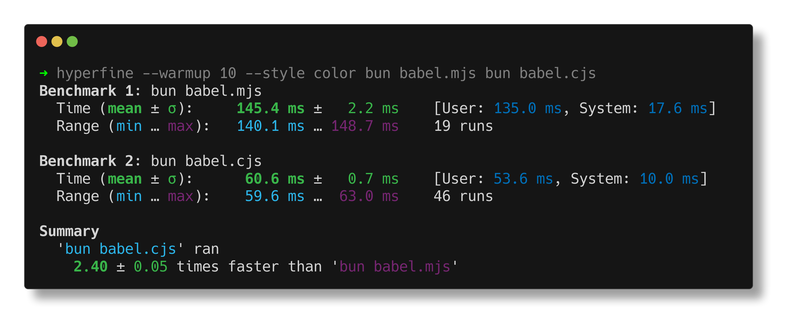
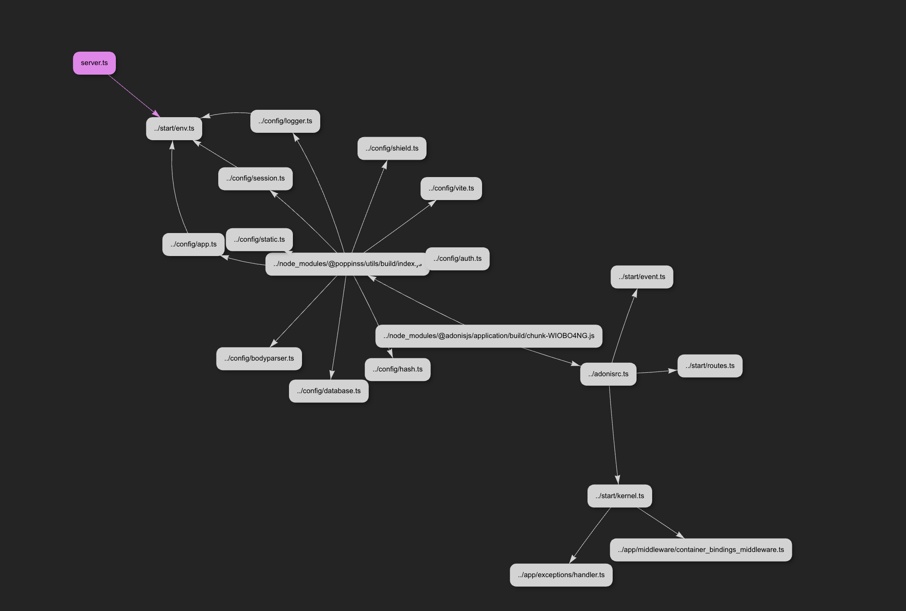

We're thrilled to announce that **HMR is now available in AdonisJS**!

Before anything, let me quickly explain what this enables. HMR now allows us to modify the code of our controllers/middleware and their dependencies (services, repositories, models, etc.) without having to restart the entire dev server each time.

This results in a significant productivity boost and a greater DX. We really love this new feature. 

We gonna first explain how to add HMR to your AdonisJS application, then we'll go into more detail about why we felt the need to add HMR to AdonisJS and how it works under the hood. Grab a coffee, it's going to be a long read!

## Adding HMR to your AdonisJS Application

To use HMR in AdonisJS, you'll first need to upgrade `@adonisjs/core` and `@adonisjs/assembler` to the latest version and install `hot-hook`.

```bash
npm i -D hot-hook @adonisjs/assembler@latest
npm i @adonisjs/core@latest
```

Next, update your `package.json` file with the following configuration:

```jsonc
// title: package.json
{
  "hotHook": {
    "boundaries": [
      "./app/controllers/**/*.ts",
      "./app/middleware/*.ts"
    ]
  }
}
```

Then run the following command to start your dev server:

```bash
node ace serve --hmr
```

Note that you don't need the `--watch` flag anymore. Only `--hmr` is enough. If you are using npm scripts, you can update your `dev` script with the following:

```jsonc
// title: package.json
{
  "scripts": {
    "dev": "node ace serve --hmr"
  }
}
```

Now, try modifying a controller, you will see that the server does not restart, but the modifications will be taken into account: you'll always have the latest version of your code.

For more information on using it in AdonisJS, you can check out the [documentation page](https://docs.adonisjs.com/hot-module-reloading).

## Backstory

Having HMR in a backend-first framework isn't very common. In fact, we didn't feel the need for it with AdonisJS 5: the server restarted very quickly, usually in less than 500ms, and if we were developing a site with templating, we used Edge. Thus, a change in a view didn't trigger a full-server reload, the modification would appear directly on our screen in less than a few milliseconds. Great.

Now, enter AdonisJS 6, with three major changes:

- We now use ESM instead of CommonJS.
- We have an alternative to Edge for SSR templating sites: TSX.
- As explained [in this article](https://adonisjs.com/blog/future-plans-for-adonisjs-6#adonisjsvite), the Vite dev server is now embedded in the AdonisJS dev server, meaning that every time we restart the AdonisJS dev server, we must also restart the Vite server.

These three changes are part of why we felt the need for HMR. We'll go into more detail on each of these points.

### ESM Migration

The biggest change in AdonisJS 6: we've completely switched to ESM. And ESM has a particularity: it loads much slower than CommonJS. Bun talks about it a bit [in this post](https://bun.sh/blog/commonjs-is-not-going-away):



As we can see, ESM takes 2.5 times longer to load than CommonJS. This benchmark was done on Bun, but the number are quite similar on Node.js. ESM takes longer to load because its design is more complex. In the Node.js documentation, you can find the resolution algorithm for these two module systems. Let's quickly look at that:

- ESM resolution algorithm: https://nodejs.org/api/esm.html#resolution-algorithm
- CommonJS resolution algorithm: https://nodejs.org/api/modules.html#all-together

We can quickly see that the ESM resolution algorithm is way more complex than the CommonJS one, which probably partly explains why it takes longer to load.

So, just migrating to ESM significantly slowed down the boot time of an AdonisJS application. We faced this problem last summer when we noticed that boot time began to explode as we migrated the packages. Particularly on Windows, which has a very slow filesystem compared to Unix systems: on my PC, I could reach up to 2/3 seconds of boot time, where the rest of the team, on Mac, had a boot time of 300/400ms.

Therefore, to solve part of this issue, maybe some of you have noticed it, we decided to bundle most of the AdonisJS packages with `tsup`: resulting in fewer files for Node.js to load and thus a quicker boot time. Just by bundling most of the packages, we managed to cut boot time **by 2 to 3 times**.

However, the problem still exists for less powerful PCs or larger applications. As we continue to add features and dependencies to our application, the boot time will inevitably increase.

### TSX as Template Engine

Now, let's talk about TSX and Edge. Before TSX, we didn't need HMR with Edge because, in the end, we already had a kind of HMR.

Since Edge uses `.edge` files, which are just standard files loaded using `readFile` and not `import`, this means that `.edge` files are not cached by Node.js. Each time we call our endpoint, we re-read the `.edge` file using `readFile`, compile it, and render it. That's it. No need to restart the entire process when we add a `<div>`. Perfect.

But now comes TSX. TSX is radically different, as it's just standard JavaScript that must be imported using `import`, which means the files are cached. And so, if we want to have the latest version of this file, we will inevitably need to restart the entire process.

Thus, any minor template modification, like adding a `<div>`, adding a `class`, requires restarting the entire Adonis dev server. Over time, this can become very frustrating, especially when working on our layout.

This problem has been raised several times by users, particularly Estéban, who explains the issue well here: https://github.com/adonisjs/core/discussions/4474

### Vite

Finally, as explained in this [article](https://adonisjs.com/blog/future-plans-for-adonisjs-6#adonisjsvite), we've changed our approach with Vite. To quickly refresh your memory, or if you're too lazy to read the article: We now launch Vite directly in the main process of AdonisJS, rather than, as before, launching it as a subprocess.

This means that, each time we restart the Adonis Dev Server, we also have to restart Vite. This has significantly impacted boot time, especially on less powerful PCs.

---

These are the main reasons that pushed us to implement HMR in AdonisJS. And even putting all this aside: regardless of the framework, a large application with many features and dependencies will inevitably suffer from a significant boot time.

There are ways to mitigate this, notably the use of dynamic imports ( `await import` ), which we'll return to below, but even with that: there will probably be pieces of code that you must execute at the launch of your server, and that will slow down the boot time.

## Existing Solutions

So, before developing our own solution, we looked a bit at what was happening elsewhere.

### Hono / NestJS

The approaches of Hono and NestJS are almost the same.

NestJS proposes Webpack as a solution: https://docs.nestjs.com/recipes/hot-reload#hot-module-replacement

So, if you want HMR with NestJS, you will need to compile your application with Webpack. I think I don't need to expand much on this: I believe nobody wants to have to configure webpack for that and adding it to their backend application. 

As for Hono, they propose the same approach but instead suggest Vite: https://github.com/honojs/vite-plugins/tree/main/packages/dev-server

But the problem remains the same. Although Vite is an fantastic tool, it still adds a lot of complexity just for HMR.

The philosophy of AdonisJS has always been to keep things simple and "use the platform" and therefore standard tools. That's why this solution didn't suit us.

### Bun / Dynohot

For those who might not know:

- Dynohot is a loader for Node.js that allows HMR: https://github.com/braidnetworks/dynohot
- Bun has a built-in `--hot` flag in their runtime: https://bun.sh/docs/runtime/hot#hot-mode

So, Bun and Dynohot have roughly the same approaches: perform code transformation and use static analysis.

With dynohot, this code:

```ts
import { importedValue } from "./a-module";
export const exportedValue = "hello world";

console.log(importedValue);
```

will be transformed into:

```ts
import { acquire } from ["hot:runtime"](hot:runtime);
import _a_module from ["hot:module?specifier=./a-module"](hot:module?specifier=./-a-module);
function* execute(_meta, _import) {
    let _$ = yield [
        next => { _$ = next },
        { exportedValue: () => exportedValue },
    ];
    yield;
    the exportedValue = "hello world";
    console.log(_$.importedValue());
}
module().load(
    { async: false, execute },
    null,
    false,
    "module",
    {},
    [ {
        controller: _a_module,
        specifier: "./a-module",
        bindings: [ {
            type: "import",
            name: "importedValue",
        } ],
    } ],
);
export default function module() { return acquire("file:///main.mjs"); }
```

More or less the same for Bun, [as seen here](https://stackoverflow.com/questions/73208846/hot-reload-hmr-with-bun-dev).

Their approach allows them to have better control over HMR and do more things. However, this results in compiled code that is radically different from the original code. And in the case of Dynohot, it forces you to install quite heavy dependencies like `@babel/traverse` and `@babel/generator`.

Again, for keeping things simple, this approach did not suit us either.

## Hot Hook

So, we finally decided to create our own solution: [Hot-Hook](https://github.com/julien-R44/hot-hook).

Hot-hook theoretically works with any framework and performs no static analysis, no heavy code transformations, no AST parsing, no bundling, no webpack/Vite.

I invite you to read the [README](https://github.com/julien-R44/hot-hook), which goes into great detail about how it works. But let's summarize it quickly.

Hot-hook is a [hook](https://nodejs.org/api/module.html#customization-hooks) for NodeJS. What is a hook? It's a thing in Node.js that allows you to intercept the import of modules and perform certain actions, like replacing or adding code in the imported module. Exactly like `ts-node`, which is also a hook: it intercepts the imports of your codebase, transpiles on the fly, and returns JavaScript content to Node.js rather than TypeScript code, since Node.js doesn't understand TypeScript.

What Hot-Hook hook will do is build a dependency tree of your modules. The relations they have between them: knowing who imports what and whom. Something like this that looks like this:



> This screenshot is taken from `@hot-hook/dump-viewer`, a small package that allows you to visualize your codebase dependency graph.

For each imported and intercepted file by Hot-Hook, we store a version number with it.

Now, when you modify a file, Hot-Hook will detect this change and increment the version number associated with that file.

Then, the next time that same file is imported: Hot-hook will intercept the import, and add the version number at the end of the import. This means, in the background, Hot-hook will transform this import:


```ts
import('#controllers/users_controller.js')
```

into this:

```ts
import('#controllers/users_controller.js?version=2')
```

And by doing this, we bypass the Node.js cache, which allows us to retrieve the latest version of the file.

Here's a brief summary of how Hot-Hook works. As mentioned above, I strongly encourage you to read the Hot-hook [README](https://github.com/Julien-R44/hot-hook), which is very detailed and also written in a way to be understood by those less experienced with Node. You should learn a thing or two along the way, I hope!

### Memory Leaks

There's a little problem with the query param approach to cache busting. There have been many discussions on this subject ([nodejs/node#49442](https://github.com/nodejs/node/issues/49442), [nodejs/help#2806](https://github.com/nodejs/help/issues/2806)) and it is currently the only way to bust the cache in ESM. The problem with this solution is that it causes memory leaks.

That said, these memory leaks are minor: first, it's only in local development (because Hot-hook is not used in production).

And secondly, these memory leaks are minor: only the files you modify directly will be affected, and in any case, you will restart your server from time to time. So, nothing super dramatic.

### Limitations

One of the limitations due to the fact that Hot-Hook does not perform code transformation is that it will only work with dynamic imports. Let's quickly explain why. Imagine the following file:

```ts
router.get('/users', () => {
  return User.all()
})
```

Here we have literally no way to replace the logic of this route. There is nothing imported. A server restart is necessary if we modify the handler.

Now imagine the following case:

```ts
import UsersController from '#controllers/users_controller'

router.get('/users', [UsersController, 'index'])
```

Almost the same problem here. We indeed have an import, but it's at the top level of our file. That means, throughout the lifecycle of the application, the `UsersController` will be imported only once: at the launch of the application, when we register our routes. So here too, no way to do cache busting and update `UsersController` when it is modified.

Now, the solution that works:

```ts
const UsersController = () => await import('#controllers/users_controller')

router.get('/users', [UsersController, 'index'])
```

Here, `UsersController` can be hot-reloaded. Because, each time we call the `/users` endpoint, then the `UsersController` will be re-imported. And by re-importing this file each time, then Hot-Hook can intercept and add the query parameter with the version number we talked about earlier.

## How AdonisJS Architecture is Perfect for Hot Hook

As we have just seen, Hot-hook will only work with dynamic imports. Which ultimately is a good thing. Splitting your application with dynamic imports is a very good practice, and luckily, that's what we've been doing in AdonisJS for years.

If you use top-level imports absolutely everywhere in your backend application, it will inevitably cause a problem, regardless of the framework you use. The problem is that when you boot your application, Node.js will have to load your entire application from the start. Which can take a lot of time.

Whereas with dynamic imports, all the code hidden behind these imports will be loaded by Node.js only when necessary: when we reach the moment to import them.

For example, in AdonisJS, we strongly recommend using dynamic imports for controllers (we even have an [eslint rule](https://docs.adonisjs.com/guides/tooling-config#eslint-config) that auto-fixes this). So, a `UsersController` (and all its dependencies, let's imagine a `UserService` and a `UserRepository`) will be loaded by Node.js ONLY when we make a call to the `/users` endpoint. If we never call this endpoint, then the `UsersController` will never be loaded by Node.js.

And by doing this, we allow the boot time not to explode as our codebase grows. This is also one of the reasons why we decided not to support the use of decorators for routing. In NestJS, they do it like this:

```ts
import aws from 'aws-sdk' // super heavy dependency to load
import { Controller, Get } from '@nestjs/common';

@Controller('users')
export class UploadController {
  @Get()
  upload(): string {
	  await aws.s3.UploadItem(...)
    return 'Data uploaded!'
  }
}
```

So, to discover all the routes of your application, NestJS will have to open and load all your controllers when booting your application.

Here, we have a simple `UploadController`. We use the AWS SDK. This means that at every restart of our application, we will load the AWS SDK, even if we had not planned to work on the upload system of our application at all. And `aws-sdk` is a very heavy dependency. Just by importing it, we take, roughly, at least an extra 100/200ms of load time.

To be fair, with NestJS, there are ways to mitigate this, we could dynamically import the heavy modules directly within our controllers methods. But often, this will make the code harder to read, and it's especially something that has to be done manually, that you have to think about doing it. You have to take the initiative. Whereas in AdonisJS, the default structure imposes it on you.

With AdonisJS, we also follow this architecture based on dynamic imports for packages that work based on Drivers. For example, `@adonisjs/mail` has a driver for SES and a driver for Sparkpost. If you only use SES, then we will not unnecessarily load the code for Sparkpost, thanks to dynamic imports.

This story with dynamic import and boot time is well known by users of Serverless/Lambda/FaaS. Since they are also impacted by this boot time in production (otherwise known as a cold start) they absolutely need to use dynamic imports at strategic places if they do not want to see their cold start time explode.

In short, that's why the default architecture of AdonisJS matches very well with Hot-Hook: most modules are lazy-imported, which makes it easy to replace them thanks to the cache busting technique proposed by Hot-hook.

## Conclusion

That's all for this long article!

We're super excited about the addition of HMR in AdonisJS: we hardly need to reload the server now, we find ourselves having to reload it maybe something like 90% less often than before, which is a real time saver and a comfort in development.

We are looking forward to read your feedback and hope you will enjoy this feature as much as we do, and if you encounter any problems, don't hesitate to open an issue or come and discuss it on the [Discord](https://discord.gg/vDcEjq6).
